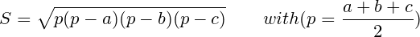

# Lab 4

    本节目标：
        1. 巩固算术运算有关知识
        2. 练习使用判断语句

## 获取及提交lab

**获取**：通过 `https://github.com/C-FUDAN-2020/lab4` 获取。

**提交物**：将你完成任务1的文档和任务2的源代码文件作为 lab4 的提交物，请进行压缩打包（格式rar或zip），并命名为学号_姓名 （如20302010000_王明.zip）。

**提交**：提交至超星学习通对应的作业中。

**截止时间**：北京时间 2020年10月18日 23:59:59 

## 任务一、思考题

根据之前课程的学习和小学二年级的经验，大家一定能熟练使用算术运算符(`+`, `-`, `*`, `/`, `+=`, `-=`, `++`, `--`)进行整数、浮点数的运算了。但是，你真的学会使用算术运算符了吗？请回答助教提出的两个问题：

> 这两个问题请提交书面答案的文档

#### 问题一：自增

观察下面一段代码，思考控制台会有何种输出，并解释原因。

```c
#include <stdio.h>

int main() {
  int x = 1;
  // level 1
  x++;
  printf("%d\n", x);
  ++x;
  printf("%d\n", x);
  // level 2
  int a1 = x++;
  printf("%d\n", a1);
  int a2 = ++x;
  printf("%d\n", a2);
  // level 3
  int b1 = x++ + x++;
  printf("%d\n", b1);
  int b2 = x++ + ++x;
  printf("%d\n", b2);
  int b3 = ++x + ++x;
  printf("%d\n", b3);
  return 0; 
}
```

#### 问题二：简单的类型转换

观察下面几段代码，它们能否通过编译，如果不能，请解释原因，如果能，x 的值为多少？并解释原因。

```c
char x = 'a';
x++;
```

```c
char x = 1;
x += 256;
```

```c
char x = 1.9f;
x = x * 1.9f;
```

```c
char a = 16.5f;
double PI = 3.14159;
short x = (float)(4 / 3) * PI * (int)a * a * (double)a;
```

## 任务二、编程题

利用海伦公式计算三角形的面积。公式如下：



输入：三角形三边的长度

输出：如果该三边可以组成三角形则直接输出面积，保留2位小数；否则输出 `no anwser`

> 注意：
> 1. 输入的三边长度可以使用double float类型的变量存储。
> 2. 不考虑负数输入，0或者其他非法输入
> 3. 根号运算请注意库`<math.h>`中的`sqrt(double)`函数
